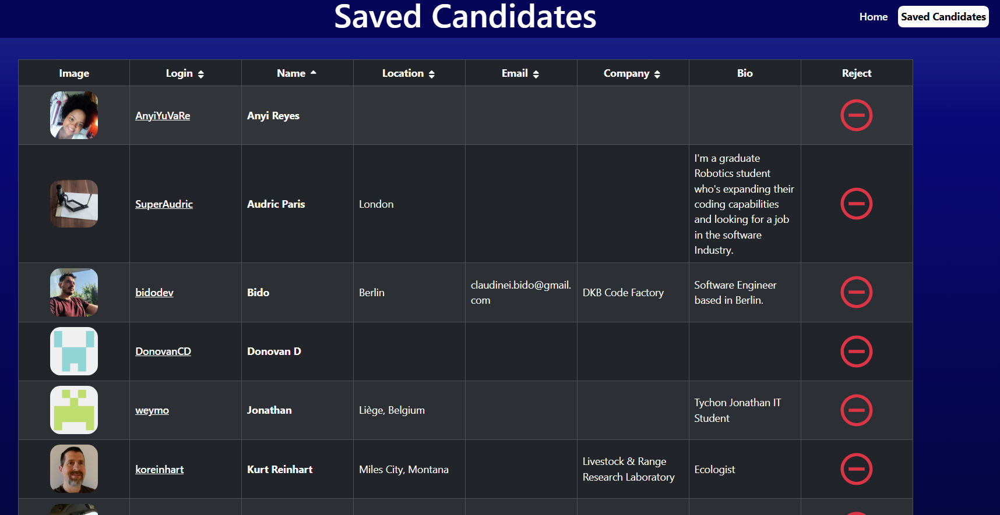

# Candidate Search

## Description

This is a tool to help search for potential candidates for your company.  Review a selection of GitHub profiles to reject or save for future review.

## Usage

Deployed: [https://candidate-search-te0y.onrender.com/](https://candidate-search-te0y.onrender.com/)

Reject or save candidates populated by using the buttons at the bottom of the candidate card.

Load all saved candidates to review further.  Reject them by using the red button in the furthest right column.

## Questions

GitHub: [cablej02](https://github.com/cablej02)

If you have additional questions, please contact me by email at [cablej02@gmail.com](mailto:cablej02@gmail.com)
